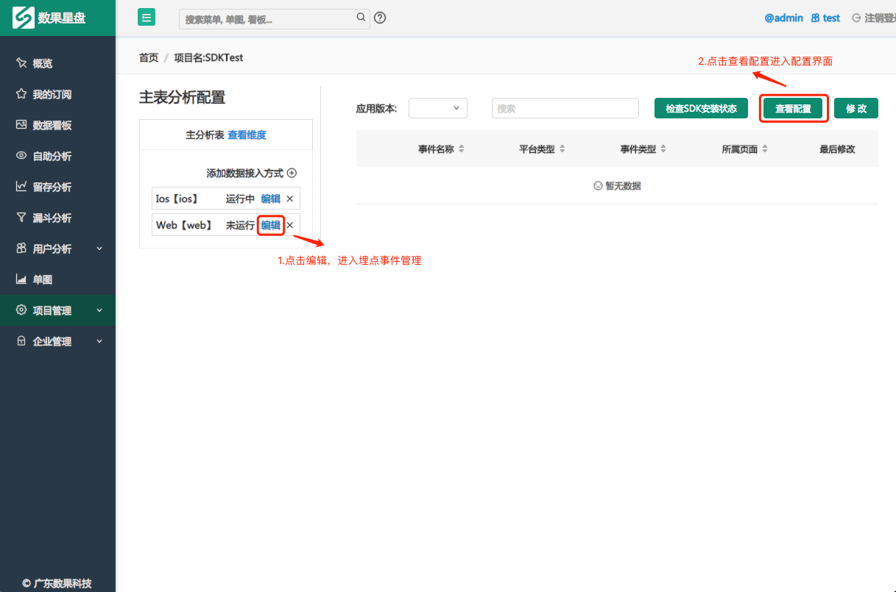

# 整合JS SDK至web 环境

将我们提供给您的 JS SDK 加入到您所需要分析的页面，请将我们给您提供的 JS SDK 复制到 &lt;head&gt; 和 &lt;/head&gt; 标签之间即可, 请务必更改“YOUR_TOKEN” , “YOUR_PROJECT_ID” 参数。您可以在数果智能 Web应用程序的项目管理的具体项目下的编辑界面的“查看设置”看到对应的TOKEN和PROJECT_ID。例如： 

