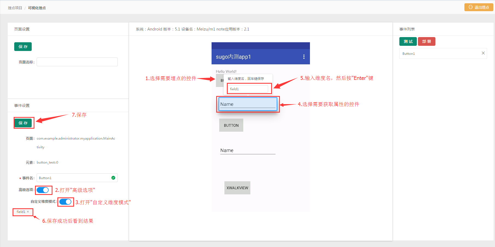

# 可视化埋点

### 进入埋点页面 {#-0}

进入项目》数据接入页面，如上图，点击 ‘编辑’，然后点击 ‘可视化埋点’，就进入埋点页面，扫描页面上的二维码即可进入以下页面：

点击 ‘打开app’，然后手机上集成了sdk 的app就会打开，吗，埋点页面上就进入埋点页面

### 埋点页面说明 {#-1}

#### 页面设置 {#-6}

页面设置 如上图part 1，用于配置页面的名称，对于h5页面，还包括配置h5页面名称，h5页面加载完成注入的js代码

#### 事件设置 {#-7}

事件设置如上图part2，用于事件绑定配置，出了配置事件名称外还能配置自定义维度，对于H5事件，还可以注入代码

#### 圈选区域 {#-8}

圈选区域如上图part3,用于选择需要绑定的控件，在ios或者android原生控件下的自定义维度模式下，用于添加自定义维度

#### 部署与测试 {#-9}

部署与测试如上图part4，点击测试后，界面能实时看到app上报的数据，用户可以点击已经埋点的控件，以验证埋点是否正确。点击部署后，埋点正式生效

#### 事件列表 {#-10}

事件列表如上图part5，显示所有已经埋点的事件

### 埋点操作 {#-2}

#### 创建事件 {#-11}

点击需要埋点的控件，接着输入绑定的事件名，点击保存。新的事件就可以在‘事件列表’看到。

#### 测试事件 {#-12}

点击‘测试’后，点击已经埋点的控件，埋点页面上就会弹出事件信息

### 部署事件 {#-3}

点击‘部署’后，事件正式生效，用于埋点的app需要重新才能看到效果

### 页面名称与页面注入代码 {#-4}

“页面名称”为当前窗口名称，android指的是当前activity,ios指的是当期controller，“H5页面名称”指的是webview中当前显示的h5页面的名称，“注入h5代码”是在页面加载完成后注入的代码。

### 原生控件事件自定义维度 {#-5}

原生控件自定义维度步骤如上图，目前只支持获取控件的文本

### h5元素事件注入代码 {#h5}

H5事件注入代码步骤如上图。代码为js代码，必须返回一个json，格式为{维度名1:维度值1,维度名2:维度值2}。

### h5元素同类元素绑定 {#h5-0}

同类元素是指css 选择器除了顺序不一样，其他都一样的元素，通常为同一级别下的同种元素，如商品列表下的商品，当对其中一个商品进行埋点时，点击其他商品同样会触发相同的事件

**维度管理**

我们推出了维度管理功能，不但能够对数据源的维度进行规范管理，例如，同步维度、批量授权、批量取消授权、维度打标签、维度标签化管理等功能，同时还可以灵活自定义新的数据维度。